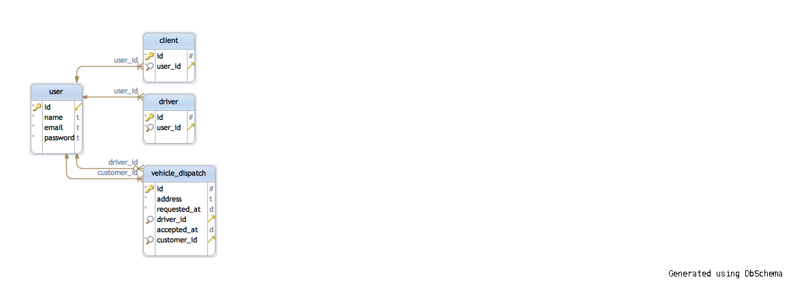

# dramancompany homework with typescritpt

## Why 
평소 관심있는 typescript 공부 겸 앞으로 있을 개인프로젝트의 빠른 프로토타이핑을 위해 간단한 웹서버.

## Technologies used:

### backend

* [Typescript](https://www.typescriptlang.org/)
* [typescript-ioc](https://www.npmjs.com/package/typescript-ioc)
* [typeorm](https://www.npmjs.com/package/typeorm)
* [docker](https://www.docker.com/)
* [koa](https://www.npmjs.com/package/koa)

### frontend
* es6
* [reactjs](https://reactjs.org/)

### 단위테스트 라이브러리

* [ts-mockito](https://www.npmjs.com/package/ts-mockito)
* [mocha](https://www.npmjs.com/package/mocha)
* [sinon](https://www.npmjs.com/package/sinon)

## 실행하기
### 미리 설치할 것 들
* [docker](https://www.docker.com/community-edition)
* [nodejs](https://nodejs.org/ko/) 8.0 버전 이상
* [git](https://git-scm.com/downloads)
### 실행방법
1. 소스받기 `git clone https://github.com/muphy/dnc.git`
2. 폴더이동 `cd dnc`
3. 의존 라이브러리 설치 `npm install`
4. 독커를 통한 mysql 실행하기 `docker-compose up`
5. api 서버 실행 `npm run start`

### 기타 실행
1. 시드 데이타 생성하기 `npm run gen`
2. api 서버 디버그하기 `npm run start:debug`

## Web API 목록
* 참고로 [postman 플러긴](https://chrome.google.com/webstore/detail/postman/fhbjgbiflinjbdggehcddcbncdddomop) 사용시 docs/postman/dnc.postman_collection.json 화일을 import 하면 미리 저장된 api 목록들을 불러올 수 있다.
### 회원 관련
1. 회원 가입 
- url: [http://localhost:3000/api/public/signup]
- method: `POST`
- headers
```
Content-Type: application/json
```
- request body
```
{"email":"test_client@gmail.com", "name":"test_client","password": "1234", "role":"CLIENT"}
```
- 참고: `일반 고객 회원 가입시는 role value 에 CLIENT, 기사는 DRIVER 를 입력`
2. 회원 로그인
- url: [http://localhost:3000/api/public/signin]
- method: `POST`
- headers
```
Content-Type: application/json
```
- request body
```
{"email":"test_client@gmail.com","password": "1234"}
```
- response body
```
{"token": "jwt값"}
```
### 택시 배차 관련 
1.일반 고객이 택시 배차를 요청.
- url: [http://localhost:3000/api/client/vehicledispatch]
- method: `POST`
- headers
```
Content-Type: application/json
Authorization: Bearer jwt값
```
- request body
```
{"address": "서울 특별시"}
```
- response body
```
{
    "customerId": 1,
    "address": "서울특별시",
    "requestedAt": "2018-02-27T21:19:06.793Z",
    "id": 1
}
```
2. 배차 목록 보기 요청.
- url: [http://localhost:3000/api/public/vehicledispatch]
- method: `GET`
- headers
```
Content-Type: application/json
```
- request body 
  `없음`
- response body
```
[
    {
        "id": 1,
        "vehicleOrder": {
            "client": {
                "userId": 1
            },
            "when": "2018-02-27T15:00:00.000Z",
            "address": {
                "name": "서울특별시"
            },
            "clientInfo": {
                "id": 1,
                "name": "test_client",
                "email": "test_client@gmail.com"
            }
        }
    }
]
```
3. 택시 기사가 고객의 요청을 승락한다.
- 이 api 호출 전 택시 기사로 로그인 후 반환 된 jwt 값을 헤더에 입력한다.
- url: [http://localhost:3000/api/driver/vehicledispatch]
- method: `POST`
- headers
```
Content-Type: application/json
Authorization: Bearer jwt값
```
- request body
```
{"id": "1"}
```
- response body
```
{
    "id": 1,
    "requestedAt": "2018-02-27T15:00:00.000Z",
    "address": "서울특별시",
    "driverId": 2,
    "customerId": 1,
    "acceptedAt": "2018-02-27T21:27:20.625Z"
}
```
4. 배차 목록 보기 요청.
- 택시 기사가 승락한 요청을 확인한다. `vehicleAccept`
- url: [http://localhost:3000/api/public/vehicledispatch]
- method: `GET`
- headers
```
Content-Type: application/json
```
- request body 
  `없음`
- response body
```
[
    {
        "id": 1,
        "vehicleOrder": {
            "client": {
                "userId": 1
            },
            "when": "2018-02-27T15:00:00.000Z",
            "address": {
                "name": "서울특별시"
            },
            "clientInfo": {
                "id": 1,
                "name": "test_client",
                "email": "test_client@gmail.com"
            }
        },
        "vehicleAccept": {
            "id": 2,
            "driver": {
                "userId": 2
            },
            "when": "2018-02-26T15:00:00.000Z",
            "isAccepted": true,
            "driverInfo": {
                "id": 2,
                "name": "test_driver",
                "email": "test_driver@gmail.com"
            }
        }
    }
]
```

## db schema
